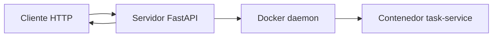

# HIT 1 - Tareas remotas en contenedores

## Objetivo

El cliente envia una tarea por HTTP. El servidor crea un contenedor temporal,
le envia los parametros al servicio tarea y devuelve el resultado. El cliente
nunca habla directamente con Docker.

## Archivos de este hit

| Archivo | Responsabilidad |
| --- | --- |
| `hit1/server.py` | Punto de entrada del servidor HTTP. |
| `hit1/task_service.py` | Punto de entrada del servicio que vive dentro del contenedor. |
| `hit1/executor.py` | Implementa la ejecucion Docker y el executor local de pruebas. |
| `shared/models.py` | Define los JSON de entrada y salida. |
| `client.py` | Cliente HTTP de consola. |
| `Dockerfile` | Imagen del servidor. |
| `task_service/Dockerfile` | Imagen del servicio tarea. |

## Flujo paso a paso

1. El cliente hace `POST /getRemoteTask` con calculo, parametros, datos e imagen.
2. `ejecutarTareaRemota()` recibe y valida el JSON.
3. `DockerTaskExecutor` levanta un contenedor temporal con la imagen indicada.
4. El servidor llama `POST /execute` dentro del contenedor.
5. El resultado vuelve al cliente y el contenedor se elimina.

## Ejecucion

```powershell
Copy-Item .env.example .env
# Para probar sin Docker:
$env:EXECUTOR = "local"
python -m uvicorn hit1.server:app --reload

# Para ejecutar con Docker (requiere Docker instalado):
$env:EXECUTOR = "docker"
python -m uvicorn hit1.server:app
```

Cliente:

```powershell
python client.py --calculation add 2 5
```

## Contrato HTTP

Request de ejemplo:

```json
{"calculation":"add","parameters":[2,5],"data":{},"image":"tp2-task-service:latest","lamport_timestamp":0}
```

Response de ejemplo:

```json
{"task_id":"...","result":7,"node_id":1,"lamport_timestamp":1,"duration_ms":2.4}
```

## Seguridad

El request solo contiene el nombre de la imagen. Nunca contiene usuario, password ni token de Docker Hub. El host se autentica previamente con `docker login` usando un token de corta duracion, o mediante identidad administrada/OIDC en el entorno cloud. Las credenciales quedan fuera del repositorio y del trafico de la API.

## Arquitectura



## Decisiones

- FastAPI para contratos JSON y health checks.
- `TaskExecutor` desacopla Docker de las pruebas.
- El modo `local` permite desarrollo sin Docker; el modo `docker` es el de despliegue.
