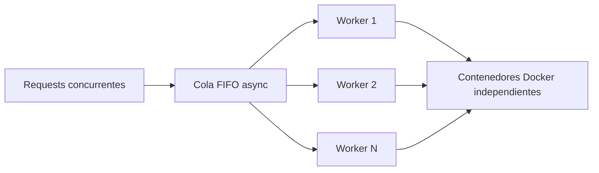

# HIT 2 - Concurrencia y exclusion mutua

## Objetivo

El servidor debe aceptar muchas solicitudes sin crear un contenedor por cada
solicitud al mismo tiempo. Para eso se usa una cantidad configurable de
workers y una cola compartida.

## Archivos de este hit

| Archivo | Responsabilidad |
| --- | --- |
| `hit2/server.py` | Punto de entrada del servidor concurrente. |
| `hit2/benchmark.py` | Punto de entrada del experimento de throughput. |
| `hit2/pool.py` | Cola FIFO y pool limitado de workers. |
| `shared/clock.py` | Reloj logico de Lamport. |

## Que ocurre cuando llegan tareas

1. FastAPI recibe cada request en una coroutine independiente.
2. La tarea se agrega a `asyncio.Queue`.
3. Un worker libre la retira atomically de la cola.
4. El worker ejecuta el contenedor y completa el `Future` de esa request.
5. Si todos los workers estan ocupados, la tarea espera en la cola.

`asyncio.Queue` evita que dos workers retiren la misma tarea. El limite se
configura con `WORKERS`.

El servidor reutiliza el endpoint del Hit 1 y agrega un pool configurable mediante `WORKERS`. Cada worker procesa una tarea a la vez. Las solicitudes excedentes quedan en una cola FIFO protegida por `asyncio.Queue`, evitando condiciones de carrera al asignar tareas.

Cada request lleva `lamport_timestamp`; el servidor ejecuta `receive(remote)` al recibirlo y avanza el reloj antes de responder.

## Ejecucion y medicion

```powershell
$env:WORKERS = "1" # repetir con 2, 4 y 8
$env:EXECUTOR = "local"
python -m uvicorn hit2.server:app
python client.py --calculation multiply 3 4
```

Para iniciar el servidor especificamente desde esta carpeta:

```powershell
python -m uvicorn hit2.server:app --port 8000
```

## Lamport

El cliente envia `lamport_timestamp`. Al recibirlo, el servidor calcula
`max(reloj_local, timestamp_recibido) + 1`; antes de responder vuelve a
incrementar el reloj. Asi las solicitudes y respuestas pueden ordenarse sin
depender de la hora fisica de cada proceso.

## Experimento

```powershell
python hit2/benchmark.py --workers 1 --tasks 100
python hit2/benchmark.py --workers 2 --tasks 100
python hit2/benchmark.py --workers 4 --tasks 100
python hit2/benchmark.py --workers 8 --tasks 100
```

Registrar para cada valor: cantidad de tareas, tiempo total y tareas por minuto. La tabla y grafica final deben incluir speedup respecto de un worker y discutir CPU, memoria, I/O, red y daemon Docker como recursos compartidos.

## Arquitectura



## Decisiones

- La cola tiene una sola operacion atomica de encolado/desencolado.
- El limite de workers se configura por ambiente.
- Los tiempos de ejecucion se devuelven por tarea para construir metricas reproducibles.
